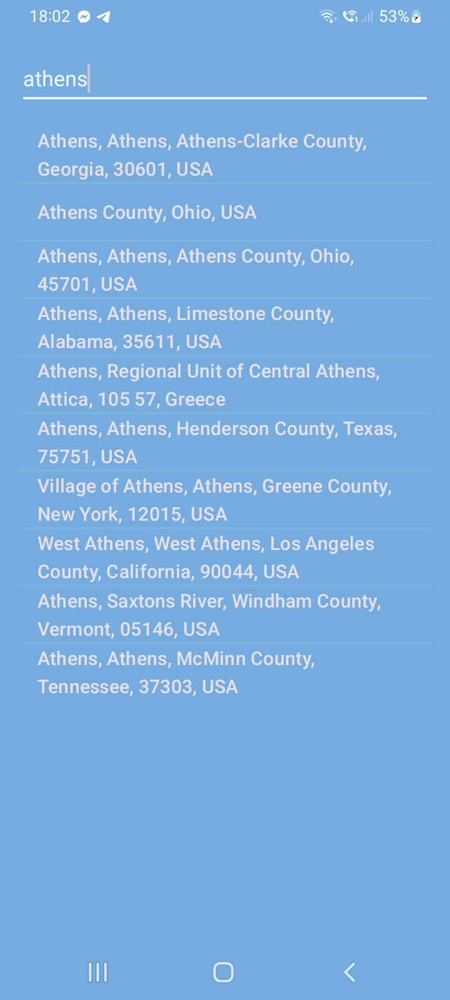

# MyWeather App

MyWeather is an intuitive weather application for Android, built using Kotlin and Android Studio. The app provides current weather conditions, forecasts, and location-based services utilizing several APIs.

## Features

- **Current Weather**: Get the current weather conditions for your location.
- **Weather Forecast**: View detailed weather forecasts for the next seven days.
- **Location Search**: Search for weather conditions in different locations using autocomplete.
- **Reverse Geocoding**: Convert geographic coordinates into a human-readable address.

## Technologies Used

- **Kotlin**
- **Android Studio**
- **Retrofit**

## APIs Used

- **[Open-Meteo API](https://open-meteo.com/)**
- **[LocationIQ API](https://docs.locationiq.com/docs/autocomplete)**
- **[OpenStreetMap Reverse Geocoding API](https://geocode.maps.co/)**

## Installation

1. **Clone the repository:**
    ```sh
    git clone https://github.com/your-username/MyWeather.git
    ```

2. **Open the project in Android Studio:**
    - File > Open > Select the `MyWeather` directory

3. **Build the project:**
    - Build > Make Project

4. **Run the project:**
    - Run > Run 'app'

## Configuration

1. **Open `local.properties` and add your API keys:**
    ```properties
    locationIQApiKey=YOUR_LOCATIONIQ_API_KEY
    reverseGeocodeApiKey=YOUR_REVERSE_GEO_CODE_API_KEY
    ```

2. **Replace `YOUR_LOCATIONIQ_API_KEY` and `YOUR_REVERSE_GEO_CODE_API_KEY` with your actual API keys.**

## Usage

1. **Search for a location** using the search bar.
2. **Select a location** from the autocomplete suggestions.
3. **View the weather forecast** for the selected location.
4. **Use the GPS feature** to get the weather for your current location.


## Screenshots

<p>



</p>
